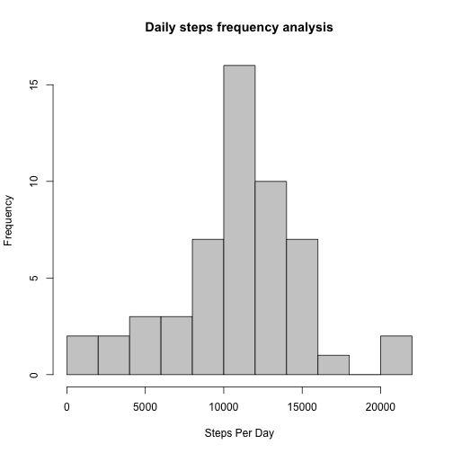

### Loading the data

The data needs to be retrieved from [Activity Monitoring Data](https://d396qusza40orc.cloudfront.net/repdata%2Fdata%2Factivity.zip "Activity Monitoring Data")


```r
datafileurl <- "https://d396qusza40orc.cloudfront.net/repdata%2Fdata%2Factivity.zip"
destfile <- "activity.zip"
download.file(datafileurl, destfile = destfile, method="curl")
```

### Preprocessing the data

Load the libraries needed for processing.


```r
library(dplyr)
library(lubridate)
library(ggplot2)
library(lattice)
```

read the data frame from the *activity.csv* file inside the downloaded **activity.zip**.


```r
DF <- tbl_df(read.csv(unz(destfile, "activity.csv")))
DF<-mutate(DF, date=ymd(date))
summary(DF)
```

```
##      steps             date               interval     
##  Min.   :  0.00   Min.   :2012-10-01   Min.   :   0.0  
##  1st Qu.:  0.00   1st Qu.:2012-10-16   1st Qu.: 588.8  
##  Median :  0.00   Median :2012-10-31   Median :1177.5  
##  Mean   : 37.38   Mean   :2012-10-31   Mean   :1177.5  
##  3rd Qu.: 12.00   3rd Qu.:2012-11-15   3rd Qu.:1766.2  
##  Max.   :806.00   Max.   :2012-11-30   Max.   :2355.0  
##  NA's   :2304
```

###1. total number of steps taken per day

In order to calculate total steps taken per day, we can group the data by date and take a sum of it.

First we need to only take **complete cases** to exclude NA values and then group it by date followed by summarizing the steps by groups.


```r
summary.stepsperday <- summarize(group_by(DF[complete.cases(DF),], date), 
                                 totalSteps=sum(steps, na.rm=TRUE),
                                 mean=mean(steps, na.rm=TRUE),
                                 median=median(steps, na.rm=TRUE))
```

1. total steps per day


```r
summary.stepsperday
```

```
## Source: local data frame [53 x 4]
## 
##          date totalSteps     mean median
## 1  2012-10-02        126  0.43750      0
## 2  2012-10-03      11352 39.41667      0
## 3  2012-10-04      12116 42.06944      0
## 4  2012-10-05      13294 46.15972      0
## 5  2012-10-06      15420 53.54167      0
## 6  2012-10-07      11015 38.24653      0
## 7  2012-10-09      12811 44.48264      0
## 8  2012-10-10       9900 34.37500      0
## 9  2012-10-11      10304 35.77778      0
## 10 2012-10-12      17382 60.35417      0
## ..        ...        ...      ...    ...
```

2. histogram of the total number of steps taken each day


```r
hist(summary.stepsperday$totalSteps, breaks=10, col =' gray80',
      xlab = "Steps Per Day",
main = "Daily steps frequency analysis" )
```

 

3. report the mean and median of the total number of steps taken per day

```r
summary(summary.stepsperday$totalSteps)
```

```
##    Min. 1st Qu.  Median    Mean 3rd Qu.    Max. 
##      41    8841   10760   10770   13290   21190
```

Additionally, the mean and median for each day is,

```r
summary.stepsperday[,c(1,3,4)]
```

```
## Source: local data frame [53 x 3]
## 
##          date     mean median
## 1  2012-10-02  0.43750      0
## 2  2012-10-03 39.41667      0
## 3  2012-10-04 42.06944      0
## 4  2012-10-05 46.15972      0
## 5  2012-10-06 53.54167      0
## 6  2012-10-07 38.24653      0
## 7  2012-10-09 44.48264      0
## 8  2012-10-10 34.37500      0
## 9  2012-10-11 35.77778      0
## 10 2012-10-12 60.35417      0
## ..        ...      ...    ...
```

###2. average daily activity pattern

1. calculate average steps per interval


```r
summary.avgstepsperinterval<-summarize(group_by(DF, interval), 
                                       avgSteps=mean(steps, na.rm=TRUE))
head(summary.avgstepsperinterval)
```

```
## Source: local data frame [6 x 2]
## 
##   interval  avgSteps
## 1        0 1.7169811
## 2        5 0.3396226
## 3       10 0.1320755
## 4       15 0.1509434
## 5       20 0.0754717
## 6       25 2.0943396
```

2. a time series plot (i.e. type = "l") of the 5-minute interval (x-axis) and the average number of steps taken, averaged across all days (y-axis)


```r
plot(summary.avgstepsperinterval$interval, summary.avgstepsperinterval$avgSteps, 
     type="l", xlab="5 minute interval", ylab="average number of steps", 
     main="Average steps of 5 minute interval")
```

 

3. 5-minute interval, on average across all the days in the dataset, containing the maximum number of steps


```r
summary.avgstepsperinterval[which.max(
    summary.avgstepsperinterval$avgSteps),]$interval
```

```
## [1] 835
```

###3. Imputing missing values

1. report the total number of missing values in the dataset


```r
length(which(is.na(DF$steps)))
```

```
## [1] 2304
```

2. filling in all of the missing values in the dataset

For imputing the data, we will fill the missing values in data set by the mean for that interval over all days.


```r
merged.data <- merge(DF, summary.avgstepsperinterval, "interval")
merged.steps.na <- is.na(merged.data$steps)
merged.data[merged.steps.na,2]<- merged.data[merged.steps.na, 4]
```

3. Create a new dataset that is equal to the original dataset but with the missing data filled in.


```r
NEWDF <- arrange(select(merged.data, steps, date, interval), date, interval)
```

4. Make a histogram of the total number of steps taken each day and Calculate and report the mean and median total number of steps taken per day. 


```r
summary.new.stepsperday <- summarize(group_by(NEWDF, date), 
                                     totalSteps=sum(steps, na.rm=TRUE))
hist(summary.new.stepsperday$totalSteps, breaks = 10, col =' gray80',
      xlab = "Steps Per Day",
     main = "Daily steps frequency analysis of Imputed Data" )
```

 

```r
summary(summary.new.stepsperday$totalSteps)
```

```
##    Min. 1st Qu.  Median    Mean 3rd Qu.    Max. 
##      41    9819   10770   10770   12810   21190
```

Plotting the total Steps for both the original and imputed data by date for comparison.


```r
summary.merged.stepsperday<-bind_rows(mutate(summary.stepsperday, type="original"), mutate(summary.new.stepsperday, type="imputed"))
ggplot(summary.merged.stepsperday, aes(date, totalSteps, color=factor(type)))+geom_line()
```

 

> ***The median after imputing the data has changed slightly.*** 

###4. differences in activity patterns between weekdays and weekends

1. Create a new factor variable in the dataset with two levels – “weekday” and “weekend” indicating whether a given date is a weekday or weekend day.


```r
NEWDF.days <- mutate(mutate(NEWDF, day=ifelse(wday(date) == 1 | wday(date)==7, "weekend", "weekday")), day=factor(day))
```

2. Make a panel plot containing a time series plot (i.e. type = "l") of the 5-minute interval (x-axis) and the average number of steps taken, averaged across all weekday days or weekend days (y-axis). 


```r
intervalStepsAvgByType <- summarise(group_by(NEWDF.days, day, interval), avgSteps=mean(steps))
xyplot(intervalStepsAvgByType$avgSteps ~ intervalStepsAvgByType$interval
        | intervalStepsAvgByType$day,
        type='l', lwd=2, layout=c(1,2),
        xlab = 'interval', ylab = 'Average steps'
        )
```

 

The distribution of steps is more uniform on the weekends than on the weekdays. There is more activity on the weekends than during the weekdays when a reduced number of steps would be evident.


